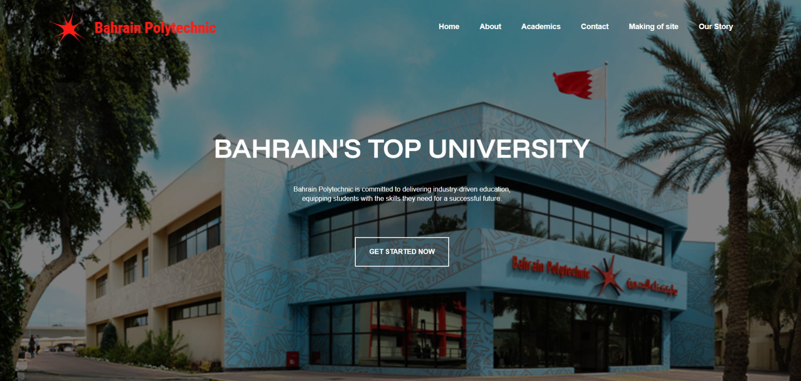

# [Bahrain Polytechnic Website](https://hasanali117.github.io/Bahrain-Polytechnic/index.html)

This project is a website for Bahrain Polytechnic University, created as part of the IT6012 - Web Fundamentals course. The website showcases various aspects of the university, including academics, faculty, facilities, and contact information.



## Table of Contents

- [Project Overview](#project-overview)
- [Features](#features)
- [Technologies Used](#technologies-used)
- [File Structure](#file-structure)
- [Setup and Installation](#setup-and-installation)
- [Usage](#usage)
- [Contributing](#contributing)

## Project Overview

The website provides information about Bahrain Polytechnic University, including details about academic programs, faculty members, facilities, and contact information. It is designed to be responsive and user-friendly, ensuring a seamless experience across different devices.

## GitHub Pages

You can view the live website on GitHub Pages: [Bahrain Polytechnic Website](https://hasanali117.github.io/Bahrain-Polytechnic/index.html)

## Features

- Home page with an overview of the university
- About Us page with information about the university's mission, vision, and values
- Academics page detailing various programs offered
- Contact Us page with a form for inquiries and a map for directions
- Responsive design for optimal viewing on different devices
- Integration with Google Fonts and Font Awesome for enhanced design

## Technologies Used

- HTML
- CSS
- JavaScript

## File Structure

```
.
├── images/
│   ├── academics/
│   └── home/
├── index.html
├── pages/
│   ├── about-us.html
│   ├── academics.html
│   ├── contact.html
│   ├── form.html
│   ├── making-site.html
│   └── our-story.html
├── README.md
├── scripts/
│   └── index.js
└── styles/
    ├── about-us.css
    ├── academics.css
    ├── admission.css
    ├── contact.css
    ├── form.css
    ├── home.css
    ├── our-story.css
    └── styles.css
```

## Setup and Installation

1. Clone the repository:
   ```sh
   git clone https://github.com/yourusername/bahrain-polytechnic.git
   ```
2. Navigate to the project directory:
   ```sh
   cd bahrain-polytechnic
   ```
3. Open the project in your preferred code editor.

## Usage

1. Open index.html in a web browser to view the home page.

2. Navigate through the different pages using the navigation bar.

## Contributing

Contributions are welcome! Please fork the repository and create a pull request with your changes.
